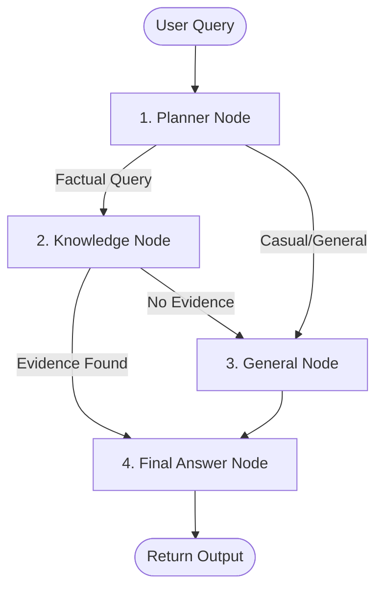

# 📚 Factual-ai

A production-grade, dark-themed Retrieval-Augmented Generation (RAG) and conversational assistant. Built with **Streamlit**, **LangGraph**, **ChromaDB**, **Gemini Embeddings**, and **DeepSeek-V3**, Factual-ai provides secure, isolated document ingestion, semantic search, and structured fallback chitchat.

---

## 🏗️ Architecture & Core Workflow

Factual-ai utilizes a state-machine architecture compiled via **LangGraph**. The workflow dynamically routes user queries between factual retrieval (grounded in uploaded documents) and general fallback nodes, maintaining strict guardrails against hallucinated or general knowledge statements.



1. **Planner Node**: Analyzes the query using DeepSeek-V3 in JSON mode to classify the intent. If it requires document lookups, it extracts a standalone search query.
2. **Knowledge Node**: Generates query vector embeddings using Google Gemini, performs a cosine-similarity search inside ChromaDB, and passes matching evidence to generate a grounded response.
3. **General Node**: Processes casual greetings and capabilities questions. Factual queries that failed retrieval are rejected here with a strict guardrail message: `"I could not find this information in the available knowledge base."`
4. **Final Answer Node**: Compiles the final answer, updates conversational thread history (using memory checkpointers), and prepares citation metadata.

---

## 🛠️ Tech Stack

- **Frontend UI**: [Streamlit](https://streamlit.io/) (enhanced dark-theme, responsive cards, interactive state metrics)
- **Agent Orchestration**: [LangGraph](https://langchain-ai.github.io/langgraph/) (state graphs with `InMemorySaver` memory checkpointing)
- **Vector DB**: [ChromaDB](https://www.trychroma.com/) (using Cosine similarity space metric)
- **Embedding API**: [Google Gemini Embeddings](https://ai.google.dev/) (`gemini-embedding-001`)
- **LLM Engine**: [DeepSeek-V3](https://github.com/deepseek-ai/DeepSeek-V3) (hosted via TCS GenAILab endpoint)
- **Document Parsing**: [PyPDF](https://pypi.org/project/pypdf/) & Python standard text-processing

---

## 📂 Project Structure

```text
Factual-ai/
├── .env                  # Environment secrets configuration
├── .gitignore            # Git exclusion patterns
├── app.py                # Main Streamlit web application
├── requirements.txt      # Project library dependencies
├── chroma_db/            # Local persistent Chroma vector store (git ignored)
├── services/             # Core business logic layer
│   ├── chroma_service.py              # Chroma database operations & schemas
│   ├── chunk_service.py               # Text chunking & page tracking
│   ├── document_ingestion_service.py  # Document upload pipeline
│   ├── document_processor.py          # Processing routing (PDF/Txt/Md...)
│   ├── document_registry.py           # Document session registry metadata
│   ├── embedding_service.py           # Google Gemini vector generation
│   ├── evidence_service.py            # Answer generator based on chunks
│   ├── langgraph_agent.py             # LangGraph state machine & logic
│   ├── llm_service.py                 # DeepSeek-V3 model completions API
│   ├── pdf_service.py                 # PDF parsing utility
│   ├── rag_service.py                 # RAG coordinate interface
│   └── text_service.py                # Text/HTML/JSON parsing utility
├── tools/                # Agent tools definition
│   └── knowledge_tool.py              # Vector store query tool
└── tests/                # Automated unit & integration tests
    └── test_core_regressions.py       # Regression test suite using unittest
```

---

## 🚀 Setup & Installation

### 1. Clone & Navigate
```bash
git clone <repository-url>
cd Factual-ai
```

### 2. Configure Environment
Create a `.env` file in the root directory:
```ini
LLM_BASE_URL=https://genailab.tcs.in
LLM_API_KEY=your_genailab_api_key
LLM_MODEL=azure_ai/genailab-maas-DeepSeek-V3-0324
GEMINI_API_KEY=your_gemini_api_key
EMBEDDING_MODEL=gemini-embedding-001
```

### 3. Create & Activate Virtual Environment
```bash
# Windows
python -m venv .venv
.venv\Scripts\activate

# macOS/Linux
python3 -m venv .venv
source .venv/bin/activate
```

### 4. Install Dependencies
```bash
pip install -r requirements.txt
```

---

## 🏃 Running the Application

Start the Streamlit application server locally:
```bash
streamlit run app.py
```
Open your browser and navigate to the local address (typically `http://localhost:8501`).

---

## 🧪 Testing

The repository includes a comprehensive regression test suite configured with unittest and local mock services to run safely without making live API calls.

To execute the test suite:
```bash
python -m unittest discover tests
```
